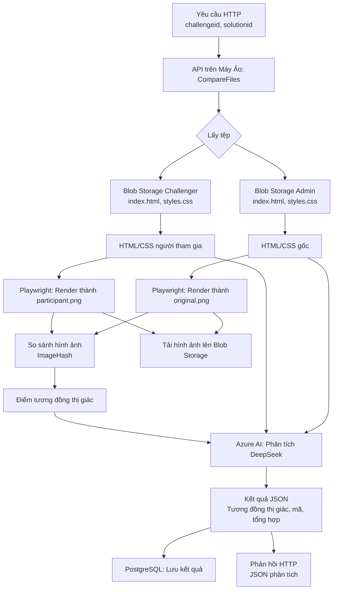

# 📝 So Sánh Trang Web HTML CSS

🎉 Chào mừng bạn đến với dự án **Web Comparison**! Đây là một ứng dụng Python được thiết kế để so sánh các trang web dựa trên HTML, CSS và hình ảnh hiển thị, chạy trên **máy ảo Azure** với cổng mở để gọi API từ bên ngoài. Dự án tích hợp Azure Blob Storage, Azure AI, Playwright để render và PostgreSQL để lưu trữ kết quả. Ứng dụng so sánh một trang web gốc (do admin gửi) với bài nộp của người tham gia, cung cấp phân tích chi tiết về mức độ tương đồng về hình ảnh và mã nguồn.

> **Lưu ý**: Dự án này không chạy trên dịch vụ Azure Functions do môi trường serverless không cố định, gây khó khăn trong việc cài đặt và duy trì Playwright. Thay vào đó, nó được thiết kế để chạy trên máy ảo Azure với môi trường ổn định.

## 📑 Mục lục

- Tổng quan dự án 🌟
- Kiến trúc 🏗️
- Sơ đồ luồng hoạt động 📊
- Yêu cầu tiên quyết ✅
- Hướng dẫn cài đặt 🛠️
- Biến môi trường ⚙️
- Triển khai trên máy ảo Azure 🚀
- Cách sử dụng 📖
- API Endpoint 🔗
- Thư viện phụ thuộc 📚
- Đóng góp 🤝
- Giấy phép 📜

## 🌟 Tổng quan dự án

Ứng dụng nhận hai tham số đầu vào: `challengeid` và `solutionid` thông qua API HTTP. Nó lấy các tệp HTML và CSS từ Azure Blob Storage cho cả bài nộp gốc (admin) và bài nộp của người tham gia, render chúng thành hình ảnh bằng Playwright, so sánh hình ảnh để đánh giá mức độ tương đồng về mặt thị giác, và sử dụng Azure AI (mô hình DeepSeek) để phân tích mức độ tương đồng mã nguồn. Kết quả được lưu vào cơ sở dữ liệu PostgreSQL, và hình ảnh render được tải lên một container Blob Storage riêng. API trả về phản hồi JSON chứa kết quả phân tích chi tiết.

## 🏗️ Kiến trúc

Dự án tích hợp các dịch vụ và thư viện sau:

- **Máy ảo Azure** 🖥️: Chứa ứng dụng Python với môi trường cố định để chạy Playwright.
- **Azure Blob Storage** 📦: Lưu trữ tệp HTML/CSS và hình ảnh render.
- **Azure AI (DeepSeek)** 🧠: Phân tích mức độ tương đồng mã nguồn.
- **Playwright** 🎨: Render HTML/CSS thành hình ảnh.
- **PostgreSQL** 🗄️: Lưu trữ kết quả phân tích.
- **ImageHash** 🖼️: Tính toán hash cảm nhận để so sánh hình ảnh.

## 📊 Sơ đồ luồng hoạt động

Dưới đây là sơ đồ luồng hoạt động của API `CompareFiles`:



## ✅ Yêu cầu tiên quyết

- **Tài khoản Azure** ☁️: Để tạo máy ảo, Blob Storage và dịch vụ AI.
- **Python 3.9+** 🐍: Cần thiết cho phát triển và chạy ứng dụng.
- **Playwright** 🎭: Để render HTML/CSS thành hình ảnh.
- **Cơ sở dữ liệu PostgreSQL** 🗄️: Để lưu trữ kết quả phân tích.
- **Git** 📂: Để quản lý phiên bản và triển khai lên GitHub.
- **Máy ảo Azure** 🖥️: Với hệ điều hành Ubuntu (khuyến nghị) và cổng mở cho API.

## 🛠️ Hướng dẫn cài đặt

1. **Sao chép kho mã nguồn**:

   ```bash
   git clone <repository-url>
   cd <repository-folder>
   ```

2. **Cài đặt thư viện phụ thuộc**: Đảm bảo Python 3.9+ đã được cài đặt, sau đó chạy:

   ```bash
   pip install -r requirements.txt
   playwright install chromium --with-deps
   ```

3. **Cấu hình biến môi trường**: Tạo tệp `local.settings.json` dựa trên mẫu được cung cấp và điền thông tin cần thiết. Xem phần **Biến môi trường** để biết chi tiết.

4. **Thiết lập tài nguyên Azure**:

   - Tạo máy ảo Azure (Ubuntu khuyến nghị) và mở cổng (ví dụ: 8000) để gọi API từ bên ngoài.
   - Tạo ba tài khoản Azure Blob Storage:
     - Admin storage (`ADMIN_STORAGE_CONN_STR`): Lưu trữ tệp HTML/CSS gốc.
     - Challenger storage (`CHALLENGER_STORAGE_CONN_STR`): Lưu trữ tệp HTML/CSS của người tham gia.
     - Image storage (`IMAGE_STORAGE_CONN_STR`): Lưu trữ hình ảnh render.
   - Thiết lập dịch vụ Azure AI với mô hình DeepSeek và lấy endpoint, tên mô hình và credential.
   - Tạo cơ sở dữ liệu PostgreSQL và ghi lại các tham số kết nối.

5. **Cài đặt máy ảo**:

   - SSH vào máy ảo Azure.

   - Cài đặt Python 3.9+, pip và các công cụ cần thiết:

     ```bash
     sudo apt update
     sudo apt install python3.9 python3-pip python3-venv
     ```

   - Sao chép mã nguồn lên máy ảo (qua Git hoặc SCP).

   - Cài đặt thư viện:

     ```bash
     pip install -r requirements.txt
     playwright install chromium --with-deps
     ```

   - Cài đặt Gunicorn để chạy API:

     ```bash
     pip install gunicorn
     ```

6. **Chạy ứng dụng cục bộ trên máy ảo**:

   ```bash
   gunicorn --bind 0.0.0.0:8000 function_app:app
   ```

   > **Lưu ý**: Đảm bảo cổng 8000 (hoặc cổng bạn chọn) được mở trong nhóm bảo mật của máy ảo trên Azure Portal.

## ⚙️ Biến môi trường

Các biến môi trường cần được cấu hình trong tệp `local.settings.json` trên máy ảo:

| Biến | Mô tả |
| --- | --- |
| `FUNCTIONS_WORKER_RUNTIME` | Đặt thành `python` cho runtime Python. |
| `AZURE_AI_ENDPOINT` | URL endpoint của dịch vụ Azure AI. |
| `AZURE_AI_MODEL_NAME` | Tên mô hình (ví dụ: `DeepSeek-V3`). |
| `AZURE_AI_CREDENTIAL` | Khóa xác thực của dịch vụ Azure AI. |
| `ADMIN_STORAGE_CONN_STR` | Chuỗi kết nối cho Blob Storage admin (tệp gốc). |
| `CHALLENGER_STORAGE_CONN_STR` | Chuỗi kết nối cho Blob Storage challenger (tệp người tham gia). |
| `IMAGE_STORAGE_CONN_STR` | Chuỗi kết nối cho Blob Storage hình ảnh (hình ảnh render). |
| `DB_PARAMS` | Chuỗi JSON chứa tham số kết nối PostgreSQL (ví dụ: `{"host": "..."}`). |

Ví dụ tệp `local.settings.json`:

```json
{
  "IsEncrypted": false,
  "Values": {
    "FUNCTIONS_WORKER_RUNTIME": "python",
    "AZURE_AI_ENDPOINT": "https://<your-ai-endpoint>.azure.com/",
    "AZURE_AI_MODEL_NAME": "DeepSeek-V3",
    "AZURE_AI_CREDENTIAL": "<your-ai-credential>",
    "ADMIN_STORAGE_CONN_STR": "<admin-blob-connection-string>",
    "CHALLENGER_STORAGE_CONN_STR": "<challenger-blob-connection-string>",
    "IMAGE_STORAGE_CONN_STR": "<image-blob-connection-string>",
    "DB_PARAMS": "{\"host\": \"<db-host>\", \"database\": \"<db-name>\", \"user\": \"<db-user>\", \"password\": \"<db-password>\", \"port\": 5432}"
  }
}
```

## 🚀 Triển khai trên máy ảo Azure

1. **Tạo máy ảo Azure**:

   - Trong Azure Portal, tạo máy ảo Ubuntu (khuyến nghị kích thước `Standard_D2s_v3` hoặc cao hơn).
   - Cấu hình nhóm bảo mật để mở cổng (ví dụ: 8000) cho truy cập API.

2. **Triển khai mã nguồn**:

   - Đẩy mã nguồn lên kho GitHub hoặc chuyển trực tiếp lên máy ảo qua SCP.

   - SSH vào máy ảo và sao chép kho mã nguồn:

     ```bash
     git clone <repository-url>
     cd <repository-folder>
     ```

3. **Cài đặt môi trường**:

   - Cài đặt các phụ thuộc như đã hướng dẫn trong **Hướng dẫn cài đặt**.
   - Đảm bảo Playwright và Chromium được cài đặt đúng.

4. **Chạy ứng dụng**:

   - Sử dụng Gunicorn để chạy API:

     ```bash
     gunicorn --bind 0.0.0.0:8000 function_app:app
     ```

   - Để chạy liên tục, sử dụng `systemd` hoặc `nohup`:

     ```bash
     nohup gunicorn --bind 0.0.0.0:8000 function_app:app &
     ```

5. **Kiểm tra API**:

   - Gửi yêu cầu HTTP tới địa chỉ máy ảo (ví dụ: `http://<vm-public-ip>:8000/api/CompareFiles?challengeid=123&solutionid=456`).

## 📖 Cách sử dụng

API được kích hoạt thông qua yêu cầu HTTP tới endpoint `CompareFiles`. Nó xử lý các tệp, thực hiện so sánh, lưu kết quả và trả về phản hồi JSON.

### 🔗 API Endpoint

- **URL**: `/api/CompareFiles`

- **Phương thức**: GET

- **Tham số truy vấn**:

  - `challengeid`: ID của thử thách (xác định container tệp admin).
  - `solutionid`: ID của bài nộp người tham gia (xác định container tệp challenger).

- **Ví dụ yêu cầu**:

  ```
  GET http://<vm-public-ip>:8000/api/CompareFiles?challengeid=123&solutionid=456
  ```

- **Ví dụ phản hồi** (Thành công):

  ```json
  {
    "status": "success",
    "message": "Xử lý hoàn tất thành công",
    "challenge_id": "123",
    "solution_id": "456",
    "analysis_result": {
      "similarity_percentages": {
        "visual_similarity": 95.5,
        "code_similarity": 90.0,
        "final_combined_similarity": 92.75
      },
      "deepseek_analysis": "...",
      "improvement_suggestions": "...",
      "overall_similarity_percentage": "...",
      "weighting_rationale": "..."
    },
    "image_container": "image-123-456",
    "timestamp": "2025-04-22 10:30:45 UTC"
  }
  ```

- **Ví dụ phản hồi** (Lỗi):

  ```json
  {
    "status": "error",
    "message": "Đã xảy ra lỗi: ID thử thách không hợp lệ",
    "challenge_id": "123",
    "solution_id": "456",
    "timestamp": "2025-04-22 10:30:45 UTC"
  }
  ```

## 📚 Thư viện phụ thuộc

Dự án sử dụng các gói Python sau (liệt kê trong `requirements.txt`):

- `azure-storage-blob`
- `azure-ai-inference`
- `azure-core`
- `playwright`
- `Pillow`
- `imagehash`
- `psycopg2-binary`
- `gunicorn` (để chạy API trên máy ảo)

Playwright yêu cầu cài đặt Chromium, được xử lý bởi lệnh:

```bash
playwright install chromium --with-deps
```

## 🤝 Đóng góp

Chúng tôi hoan nghênh mọi đóng góp! Vui lòng làm theo các bước sau:

1. Fork kho mã nguồn.
2. Tạo một nhánh tính năng (`git checkout -b feature/your-feature`).
3. Commit các thay đổi của bạn (`git commit -m 'Thêm tính năng của bạn'`).
4. Đẩy lên nhánh (`git push origin feature/your-feature`).
5. Mở một pull request.

## 📜 Giấy phép

Dự án này được cấp phép theo Giấy phép MIT. Xem tệp LICENSE để biết thêm chi tiết.

## 📧 Liên hệ

Email: chauanhkiet2906@gmail.com

---

⭐️ Nếu bạn thấy dự án này hữu ích, hãy cho tôi một ngôi sao trên GitHub!
